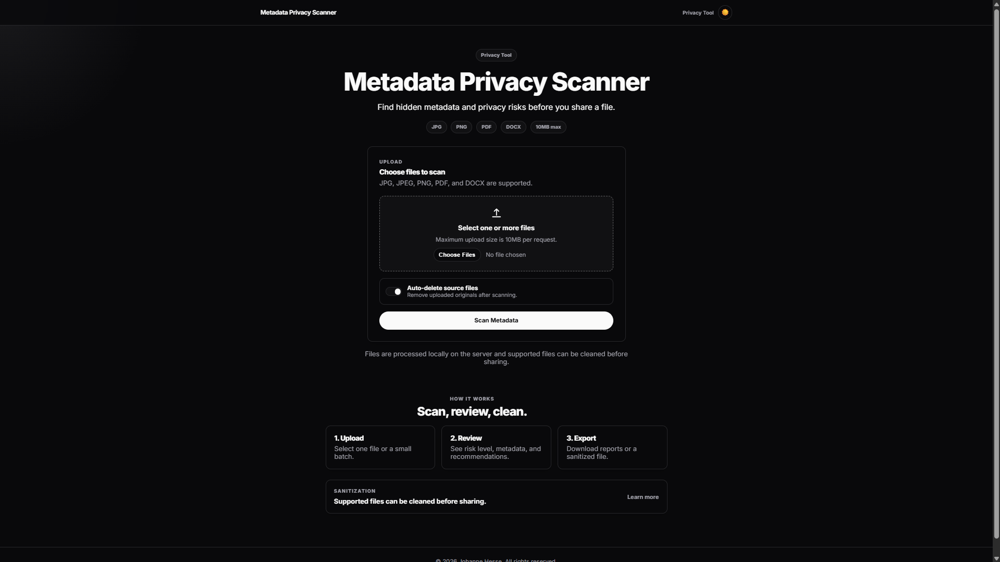
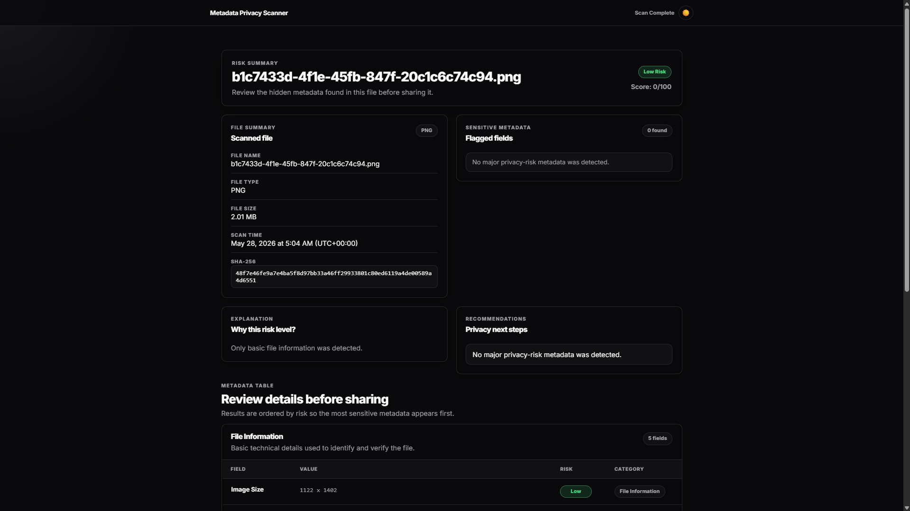
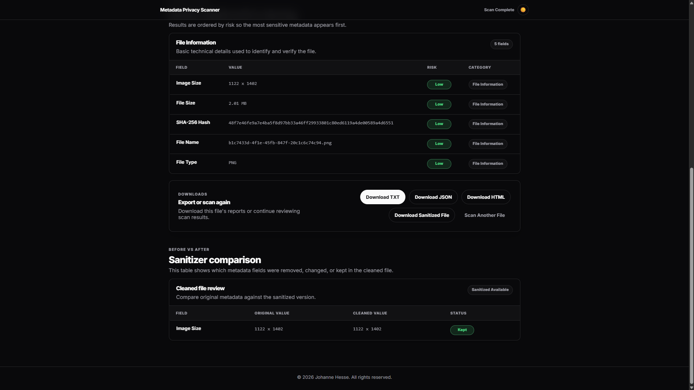
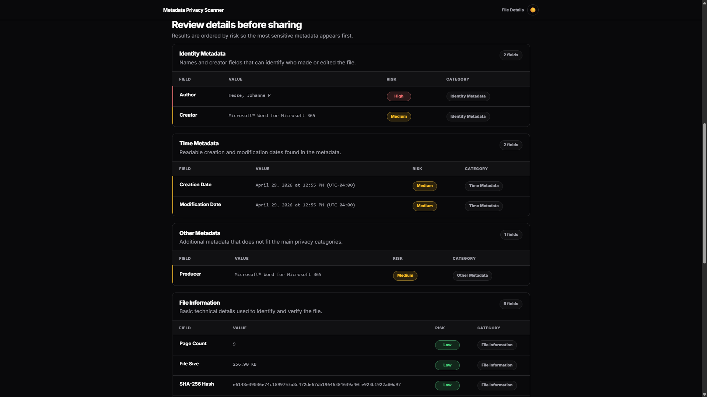
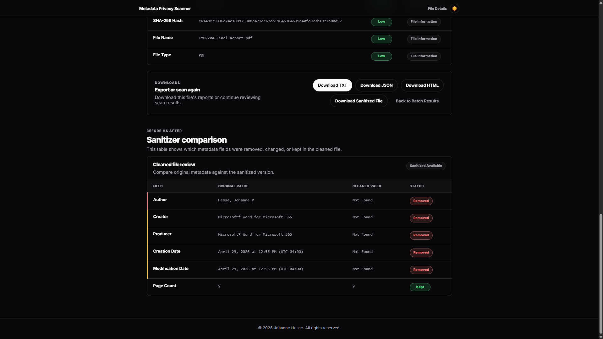

# Metadata Privacy Scanner Web App

## Screenshots

### Homepage



### Low-Risk Results



### Metadata Table and Downloads



### High-Risk Metadata Table



### Sanitizer Comparison



## Overview

Metadata Privacy Scanner is a Python Flask web app that helps users identify hidden metadata in uploaded images, PDFs, and DOCX documents.
## Features

- Upload and scan one file or a batch of JPG, JPEG, PNG, PDF, and DOCX files.
- Enforces secure filenames, extension validation, magic-byte validation, and a 10MB upload limit.
- Applies a Pillow image pixel limit to reduce decompression-bomb risk.
- Extracts image metadata using ExifTool when available, with Pillow as a fallback.
- Extracts PDF metadata with PyMuPDF.
- Extracts DOCX core properties with python-docx.
- Converts PDF, EXIF, and DOCX timestamps into human-readable dates.
- Calculates a privacy risk score and labels scans as Low, Medium, or High risk.
- Highlights sensitive fields such as GPS location, author names, device details, timestamps, and software metadata.
- Groups findings into Identity, Location, Device, Time, File Information, and Other Metadata categories.
- Shows a risk explanation section that describes why a file received its score.
- Generates tailored privacy recommendations based on the metadata found.
- Sanitizes supported files by removing image EXIF data, common PDF metadata, and DOCX core properties where possible.
- Shows a before/after comparison table for cleaned files.
- Supports automatic deletion of uploaded source files after scanning.
- Generates downloadable `.txt` reports in the `reports` folder.
- Generates downloadable `.json` reports for structured scan output.
- Generates downloadable `.html` reports for browser-friendly reporting.
- Provides improved user-friendly errors for empty uploads, unsupported files, oversized files, and corrupt files.
- Uses a polished custom interface with cards, badges, responsive layout, and risk-specific styling.
- Includes pytest coverage and a GitHub Actions workflow that runs tests on push and pull requests.
- Includes Docker and Docker Compose support for repeatable deployment.

## Tools Used

- Python
- Flask
- Custom CSS
- ExifTool
- Pillow
- PyMuPDF
- python-docx
- Docker
- Docker Compose
- pytest
- GitHub Actions


## How It Works

1. A user uploads one or more supported files through the Flask form.
2. The app validates the extension, checks file signatures, and saves the file with a safe server-side filename in `uploads/`.
3. The scanner extracts metadata based on the file type.
4. Raw PDF, EXIF, and DOCX dates are converted into readable values such as `April 29, 2026 at 12:41 PM (UTC-04:00)`.
5. Each metadata field is categorized and classified as Low, Medium, or High risk.
6. The results page displays the risk level, score, explanation, sensitive fields, recommendations, and grouped metadata tables.
7. A cleaned file is generated in `cleaned/` when the file type supports sanitization.
8. TXT, JSON, and HTML reports are generated in `reports/` and made available for download.
9. If auto-delete is enabled, uploaded source files are removed after scanning.

## Sanitizer

- Images: re-saves the image without EXIF metadata.
- PDFs: clears common document metadata fields through PyMuPDF where possible.
- DOCX: blanks core properties such as author, last modified by, title, and subject where possible.

Cleaned files are stored in `cleaned/`, which is ignored by Git except for `.gitkeep`.

## Batch Scan

The upload form accepts multiple files. Batch results show a dashboard with file name, type, risk level, score, sensitive field count, report downloads, and cleaned file download links when available.

## Privacy Controls

The homepage includes an auto-delete option. When enabled, uploaded source files are deleted after scanning while generated reports and cleaned files remain available for download.

## Testing

Run the test suite locally with:

```bash
pytest
```

GitHub Actions runs the same test suite on push and pull requests.

## Risk Scoring

- Low Risk: only basic technical details were found, such as file size, file type, hash, or page count.
- Medium Risk: software names, timestamps, PDF creator/producer data, or similar operational metadata were found.
- High Risk: GPS coordinates, author names, last modified by values, camera make/model, or personal identifying metadata were found.

The score is intentionally simple and explainable: high-risk fields add more weight than medium-risk fields, and the final score is capped at 100.

## Metadata Categories

- Identity Metadata: author, last modified by, and creator fields.
- Location Metadata: GPS latitude and longitude.
- Device Metadata: camera make, camera model, and software fields.
- Time Metadata: creation, modification, and EXIF date/time fields.
- File Information: file name, file type, file size, SHA-256 hash, page count, and image size.
- Other Metadata: any supported fields that do not fit the primary categories.

## Installation

```bash
python -m venv .venv
source .venv/bin/activate
pip install -r requirements.txt
python app.py
```

On Windows PowerShell:

```powershell
python -m venv .venv
.\.venv\Scripts\Activate.ps1
pip install -r requirements.txt
python app.py
```

Open the app at:

```text
http://localhost:5000
```

## Docker Setup

Build and run the app with Docker Compose:

```bash
docker compose up --build
```

For production-like deployments, provide a strong Flask secret key before starting Compose:

```bash
SECRET_KEY="use-a-long-random-value" docker compose up --build
```

Then visit:

```text
http://localhost:5000
```

The Docker image installs ExifTool so image metadata extraction can use it when available.

Generated uploads, reports, and cleaned files are mounted as local folders by `docker-compose.yml`; their contents are ignored by Git.

## GitHub Actions

The included workflow at `.github/workflows/tests.yml` installs dependencies and runs `pytest` on push and pull requests.

## Example Output

```text
File Name: example.jpg
File Type: JPEG
File Size: 2.14 MB
SHA-256 Hash: 4f8c...
Risk Level: High
Risk Score: 100/100
Cleaned File Status: Cleaned

Risk Explanation:
GPS location data can reveal where an image was taken. Device metadata can reveal the camera, phone, or software used.

Sensitive Metadata Found:
- GPS Latitude
- GPS Longitude
- Camera Model

Recommendations:
- Remove GPS metadata before sharing this image publicly.
- Device metadata can reveal the camera, phone, or software used.
```


## Future Improvements

- Add a scan history page backed by SQLite.
- Add authentication for multi-user deployments.
- Add deeper file-type detection using libmagic.
